## What you'll do

Get exact counts in CODAP's case table with formulas, practising on `compas_classroom.csv` and `c_charge_degree` first.

- **Part A · Base rates by group** (Exercise 1): n, positives and base_rate for each group. About 5 minutes.
- **Part B · One confusion matrix per group** (Exercise 2): TP, FN, FP and TN for each group, on test rows. About 5 minutes.

**How to move:** right arrow key or space bar. Esc shows all slides.

::: notes
Students practise on the warm-up file and column, then repeat with their own dataset and protected attribute.
:::

## Before you start

- Have `compas_classroom.csv` open in CODAP, as in the warm-up. ([compas_classroom.csv on GitHub](https://github.com/acintron-cc/hon-2501-03/blob/main/datasets/compas_classroom.csv); [CODAP](https://codap.concord.org))
- Formulas are in boxes with a copy button. Copy them; don't retype them.
- When you have practised, do the same with your own file and group column: `race_group` (Partner A, COMPAS) or `sex` (Partner B, Adult).

::: notes
If a student closed CODAP after the warm-up, they re-import the file: File → Import… → Local File.
:::

## Part A · Base rates by group {.divider}

For Exercise 1. Five steps, then two short tips.

::: notes
Part A has no screenshots yet; the steps are text only.
:::

## Part A · Step 1 of 5: Group the table

Drag the `c_charge_degree` column heading to the **left edge** of the case table.

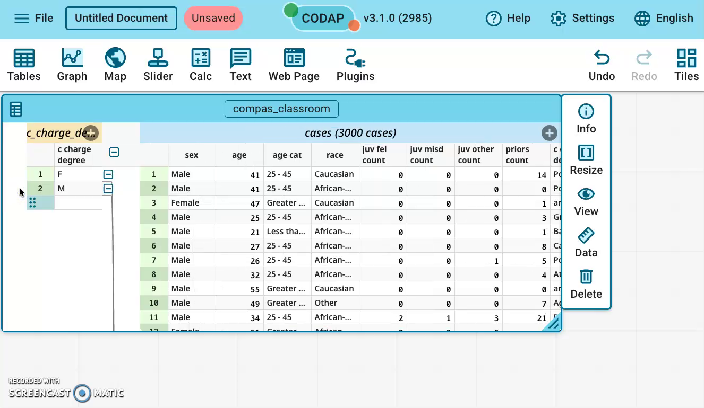{.r-stretch fig-alt="The CODAP case table split in two: on the left a group part with one row each for F and M, on the right the people. c_charge_degree is now the only column of the left part."}

**You should see:** the table splits: one row per group on the left (F and M), the people on the right.

::: notes
The left part's title bar becomes yellow and names the grouping, e.g. c_charge_degrees (2 cases).
:::

## Part A · Step 2 of 5: Add a column n

In the **left part**, click **+** to add a column, type `n` as its name, and press Enter.

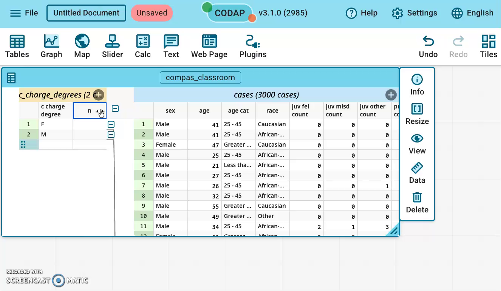{.r-stretch fig-alt="The left (group) part of the table with a new, empty column named n next to c_charge_degree."}

**You should see:** a new, empty column named n in the left part.

::: notes
The + is on the yellow title bar of the left part.
:::

## Part A · Step 3 of 5: Count the people

Click the `n` heading → **Edit Formula…**, type this formula, then click **Apply**:

```
count()
```

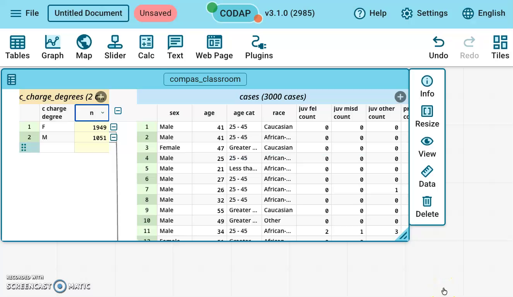{.r-stretch fig-alt="The left part of the table with the n column showing 1949 for F and 1051 for M."}

**You should see:** F 1949, M 1051.

::: notes
In the group part, count() counts the people in each group.
:::

## Part A · Step 4 of 5: Count label = 1

In the left part, add a column named `positives` with this formula:

```
count(label, label=1)
```

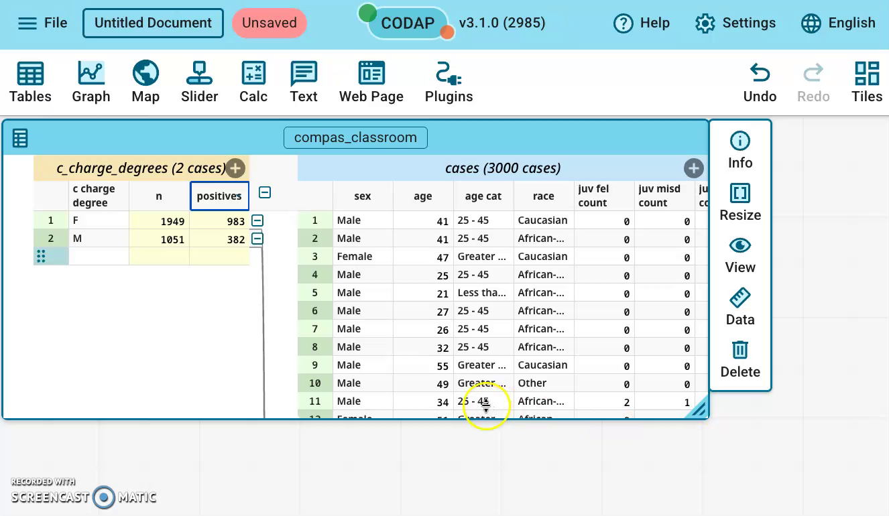{.r-stretch fig-alt="The left part of the table with a positives column showing 983 for F and 382 for M, next to n."}

**You should see:** F 983, M 382.

::: notes
Read it as: count the rows where label equals 1.
:::

## Part A · Step 5 of 5: The base rate

In the left part, add a column named `base_rate` with this formula. It uses the two columns you just made:

```
positives / n
```

The base rate is the share of the group with label = 1, so it is positives divided by n.

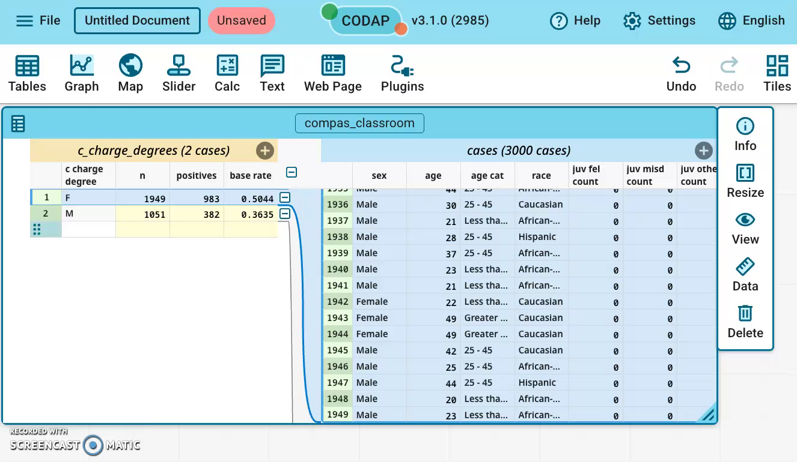{.r-stretch fig-alt="The left part of the table with columns n, positives and base rate: F 1949, 983, 0.5044; M 1051, 382, 0.3635."}

**You should see:** F 0.504, M 0.363 (0.5044 and 0.3635 with 4 decimals, as in the picture).

::: notes
CODAP may round the display to 0.5 and 0.36; the precision tip comes two slides later.
:::

## Careful: use the left part

::: warn
Add n, positives and base_rate in the **LEFT** (group) part.

In the right part, `count()` counts the whole file and shows **3000** on every row.
:::

If you see 3000 on every row, delete that column and add it again in the left part.

<!-- {.r-stretch fig-alt="A column named n added by mistake in the right (people) part of the table, showing 3000 on every row."} -->

::: notes
This is the most common Part A mistake.
:::

## Tip: show more decimals

CODAP may show base_rate as 0.5 and 0.36.

Click the `base_rate` heading → **Edit Attribute Properties…** → set **Precision** to 4.

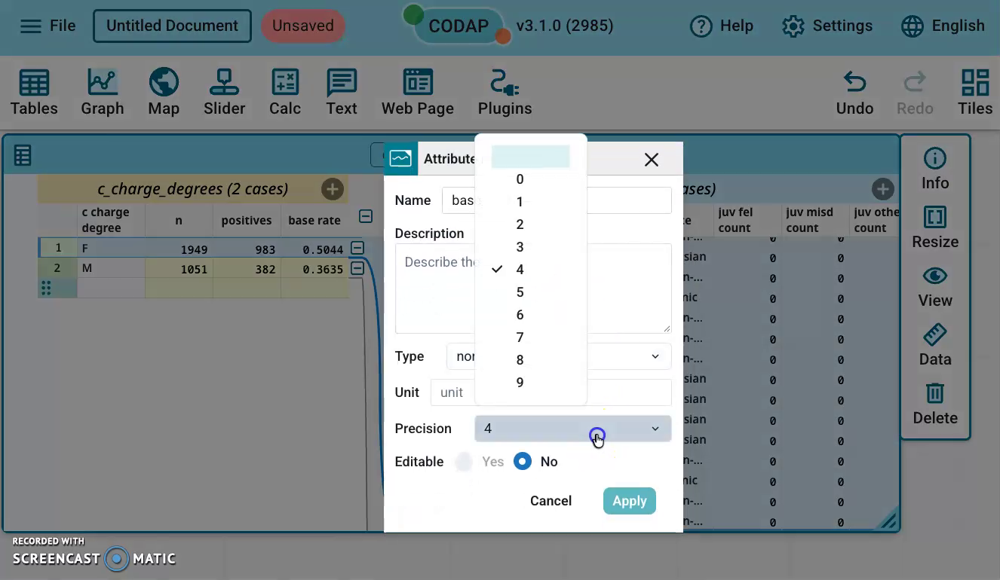{.r-stretch fig-alt="The Attribute Properties window for base_rate, with the Precision list open and 4 selected; behind it, base rate shows 0.5044 for F and 0.3635 for M."}

**You should see:** 0.5044 and 0.3635.

::: notes
These match the Part B recording, which shows base rate with 4 decimals.
:::

## Part B · One confusion matrix per group {.divider}

For Exercise 2. Keep the table grouped from Part A; you will undo the grouping at the very end.

::: notes
Part B starts from the grouped table with n, positives and base_rate already in the left part.
:::

## Part B in two steps

1. In the **right part** (the people), give each person a short code: which rows (test or train), then Actual (label), then Predicted.
2. In the **left part** (the groups), count each code.

We use only **test rows**: rows the model never learned from.

::: notes
Do not join conditions with "and" inside count(): in CODAP v3.1.0 that fails with "Invalid arguments for multiply operator". The two-step code avoids that and avoids nested if().
:::

## Part B · Step 1 of 9: Add a column for people

Scroll the people's part (blue bar “cases (3000 cases)”) to the far right, then click the **+** at the end of that bar.

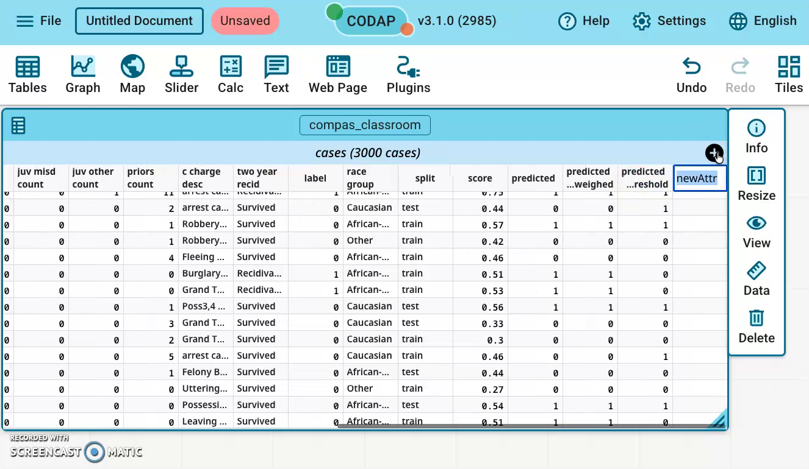{.r-stretch fig-alt="The people's part of the CODAP table, scrolled to the right, with a new column named newAttr at the right end next to predicted_threshold."}

**You should see:** a new column called newAttr at the right end.

::: notes
The blue bar belongs to the people (cases); the yellow bar belongs to the groups.
:::

## Careful: the blue bar, not the yellow bar

::: warn
Add this column with the **+** on the **blue** “cases (3000 cases)” bar.

If you use the **+** on the **yellow** group bar on the left (“c_charge_degrees (2 cases)”), the formula shows “invalid…” on every group row.
:::

Fix: delete that column and add it again from the blue bar.

::: notes
Instructor-tested: a cell column added on the yellow group bar gives "invalid…" on every group row. No screenshot of this.
:::

## Part B · Step 2 of 9: Name it cell

Type `cell` as the new column's name and press Enter. You choose this name.

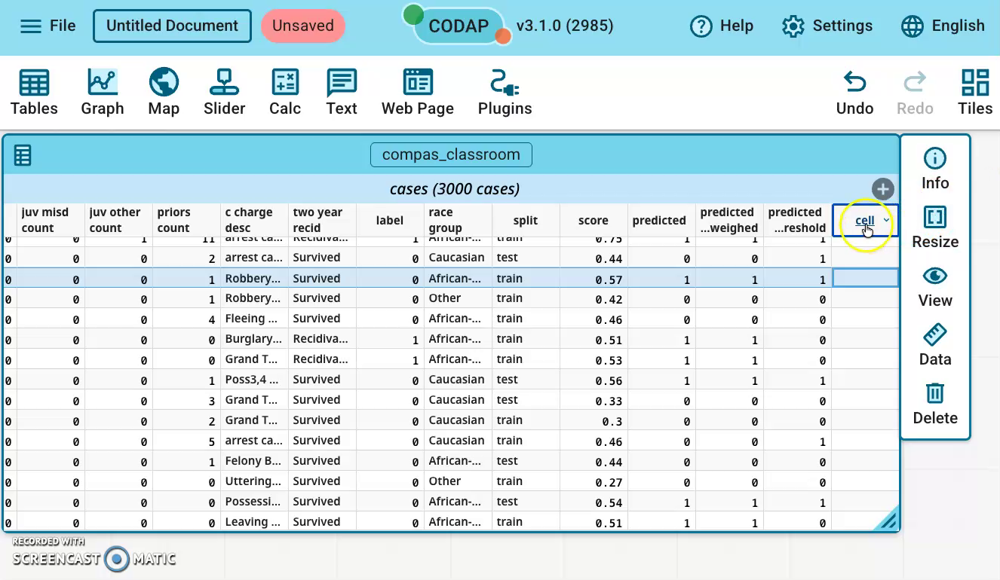{.r-stretch fig-alt="The same table with the new column renamed cell; the column is still empty."}

**You should see:** the column is now called cell, still empty.

::: notes
Any name works, but the formulas later use cell.
:::

## Part B · Step 3 of 9: Build the code

Click the `cell` heading → **Edit Formula…**, type this formula, then click **Apply**:

```
split + label + predicted
```

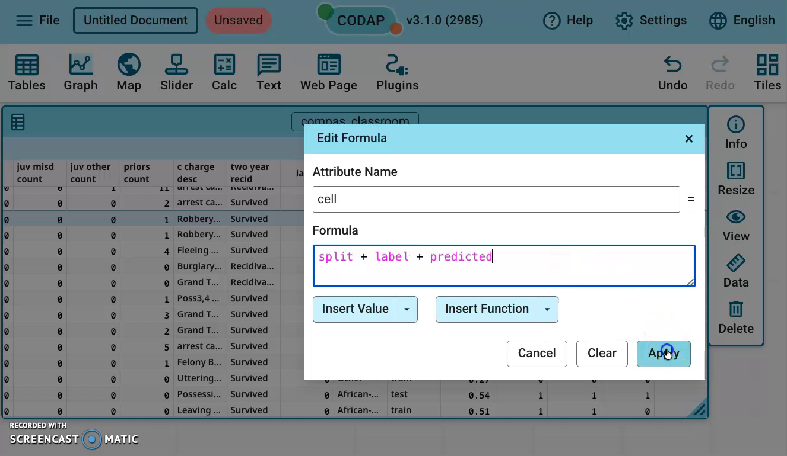{.r-stretch fig-alt="The Edit Formula window for the attribute cell, with the formula split + label + predicted typed in and the pointer on Apply."}

**You should see:** the formula in the Edit Formula window, ready to apply.

::: notes
CODAP joins text and numbers with +, so this builds a short text code for each row.
:::

## Part B · Step 4 of 9: Read the codes

Look at the `cell` column: each row's code joins its split, label and predicted values.

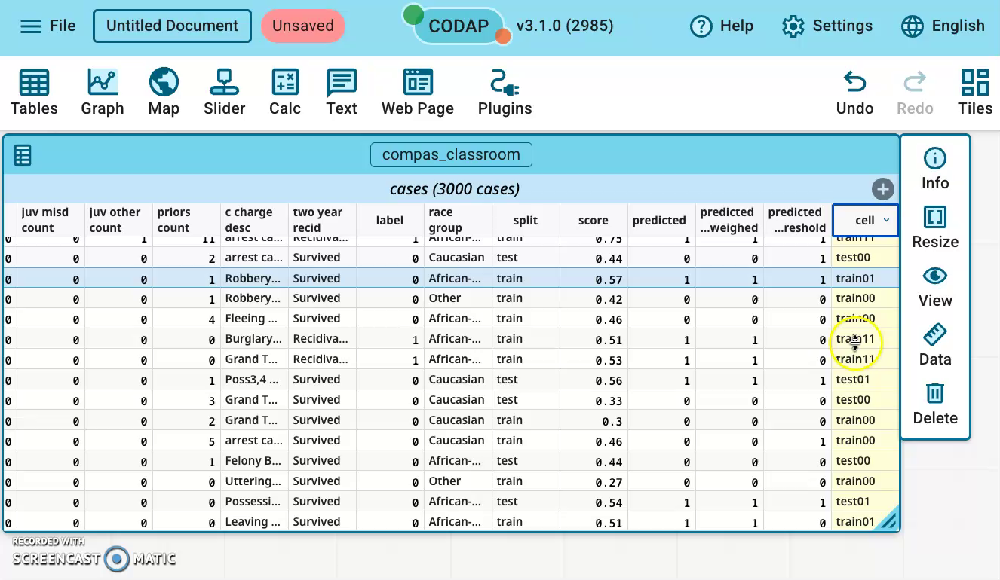{.r-stretch fig-alt="The cell column now filled with codes such as test00, train01, train00, train11 and test01, one per row."}

**You should see:** codes such as test11, test01, train00. A test row with label 1 and predicted 1 shows test11.

::: notes
Point out one test row and read its code aloud: test, then Actual, then Predicted.
:::

## What each code means

| Code | Actual (label) | Predicted | Cell of the matrix |
|---|---|---|---|
| test11 | 1 | 1 | TP |
| test10 | 1 | 0 | FN |
| test01 | 0 | 1 | FP |
| test00 | 0 | 0 | TN |

Read a code as: which rows, then Actual, then Predicted. Training rows start with `train`.

::: notes
Same layout as the handout's confusion-matrix table.
:::

## Why only test codes?

We count only the test codes, because the model never saw those rows.

Training codes are there too, but counting them would make the model look better than it is.

::: notes
Test rows: split = test. COMPAS has 900 test rows in all.
:::

## Part B · Step 5 of 9: Add TP to the groups

Scroll back left, click the **+** on the yellow group title bar (“c_charge_degrees (2 cases)”), type `TP`, and press Enter.

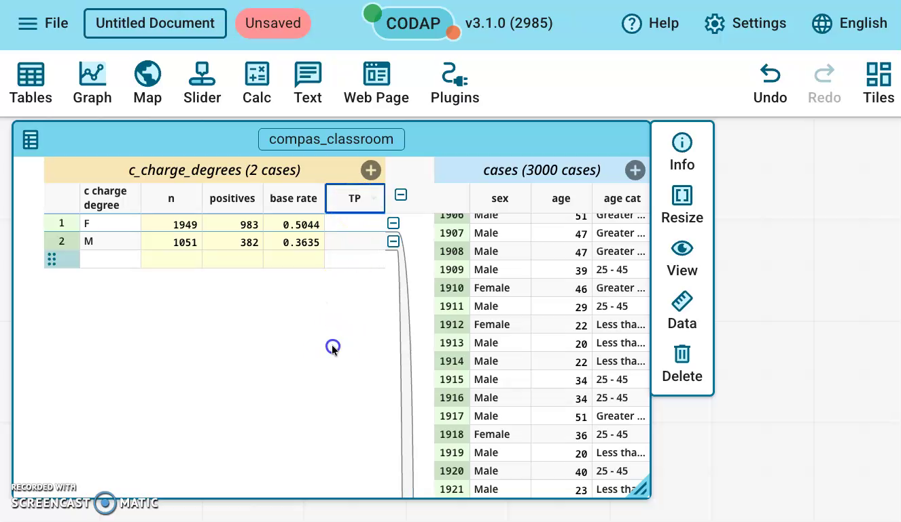{.r-stretch fig-alt="The grouped table with rows F and M showing n, positives and base rate (1949, 983, 0.5044 and 1051, 382, 0.3635) and a new empty column named TP."}

**You should see:** a new, empty TP column next to n, positives and base_rate.

::: notes
Now we are back in the left (group) part, where counts are per group.
:::

## Part B · Step 6 of 9: Count TP

Click the `TP` heading → **Edit Formula…**, type this formula, then click **Apply**:

```
count(cell, cell="test11")
```

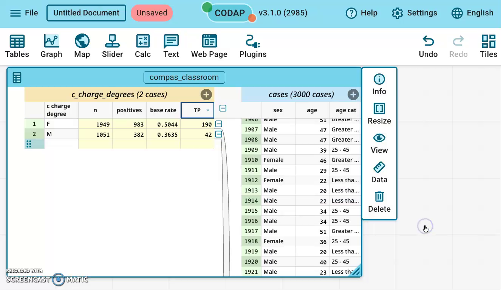{.r-stretch fig-alt="The TP column shows 190 for F and 42 for M."}

**You should see:** F 190, M 42. Same pattern as positives: count the rows where a column equals a value.

::: notes
TP: Actual 1, Predicted 1 (test11). Verified against compas_classroom.csv.
:::

## Part B · Step 7 of 9: Count FN

Add a column `FN` in the left part with this formula:

```
count(cell, cell="test10")
```

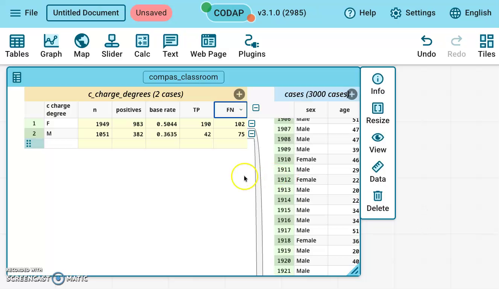{.r-stretch fig-alt="The FN column, next to TP, shows 102 for F and 75 for M."}

**You should see:** F 102, M 75.

::: notes
FN: Actual 1, Predicted 0 (test10). Verified against compas_classroom.csv.
:::

## Part B · Step 8 of 9: Count FP

Add a column `FP` in the left part with this formula:

```
count(cell, cell="test01")
```

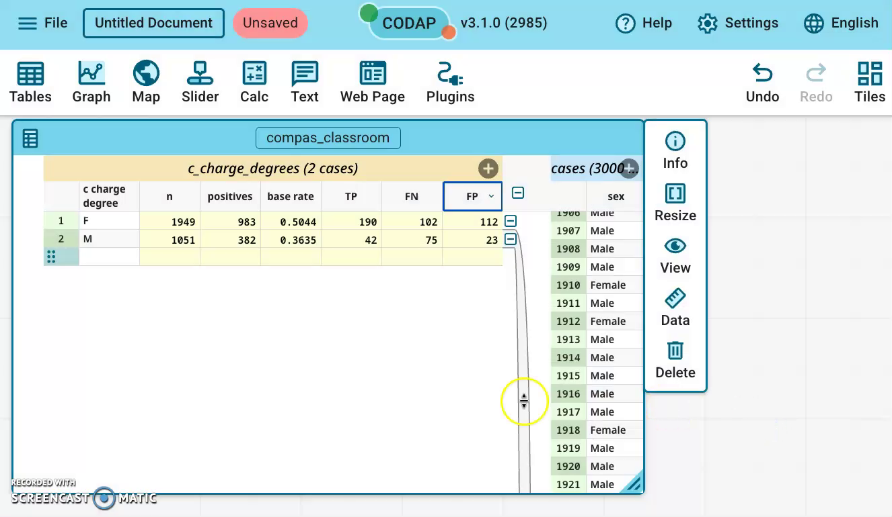{.r-stretch fig-alt="The FP column shows 112 for F and 23 for M."}

**You should see:** F 112, M 23.

::: notes
FP: Actual 0, Predicted 1 (test01). Verified against compas_classroom.csv.
:::

## Part B · Step 9 of 9: Count TN

Add a column `TN` in the left part with this formula:

```
count(cell, cell="test00")
```

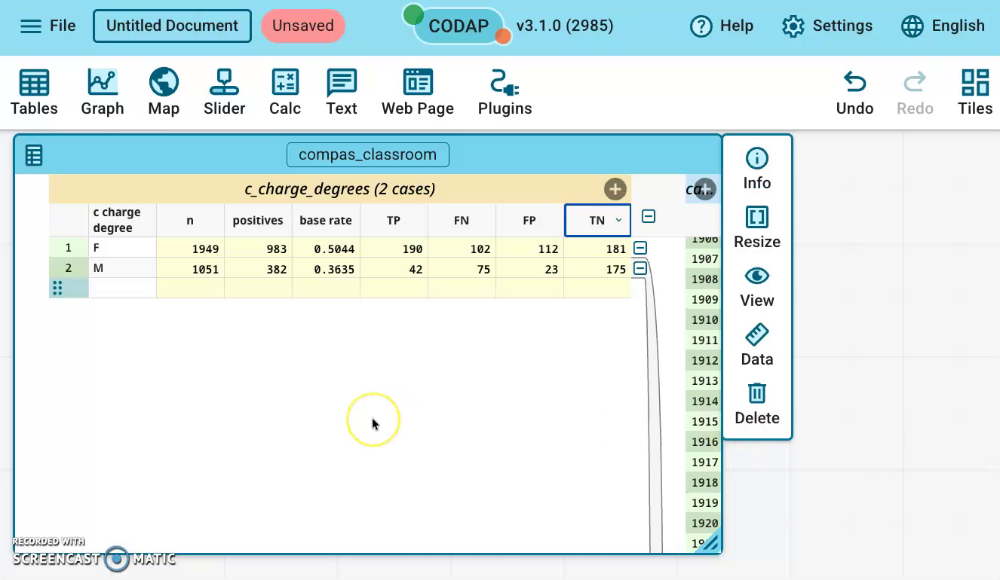{.r-stretch fig-alt="The finished group table: for F, TP 190, FN 102, FP 112, TN 181; for M, TP 42, FN 75, FP 23, TN 175."}

**You should see:** F 181, M 175.

::: notes
TN: Actual 0, Predicted 0 (test00). Verified against compas_classroom.csv.
:::

## Check your numbers

| c_charge_degree | TP | FN | FP | TN | Test rows |
|---|---|---|---|---|---|
| F (felony) | 190 | 102 | 112 | 181 | 585 |
| M (misdemeanor) | 42 | 75 | 23 | 175 | 315 |

Check: TP + FN + FP + TN equals the group's number of test rows.

::: notes
Recomputed from compas_classroom.csv, test rows, original model (predicted).
:::

## Last step: Undo the grouping

Record your numbers first. Then drag the `c_charge_degree` column heading back into the right part of the table.

<!-- {.r-stretch fig-alt="The case table back in one part, with c_charge_degree among the people's columns after it was dragged back to the right."} -->

**You should see:** one table again, one row per person.

::: notes
Group columns (n, positives, TP…) may disappear when the grouping is undone, so students record numbers in Answers first. Check this in CODAP before class.
:::

## Next: your own dataset

Do Parts A and B again on your own file, with your group column instead of `c_charge_degree`:

- **Partner A: COMPAS**, `race_group`: African-American and Caucasian (ignore the Other row). Test rows: 463 and 307.
- **Partner B: Adult**, `sex`: Female and Male. Test rows: 200 and 400.

[Optional: watch all the Part B steps in one silent video (about 3.5 min)](media/codap-grouping/CODAP_grouping_steps_labeled.mp4){target="_blank"}. Everything in the video is in the steps above.

::: notes
The test-row totals come from the handout's Exercise 2 check. The video is 3 min 26 s.
:::
