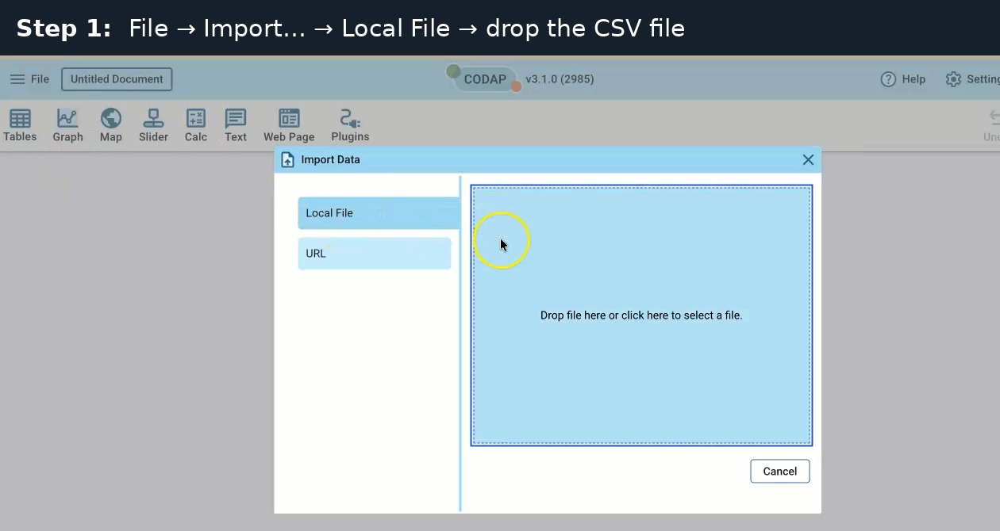
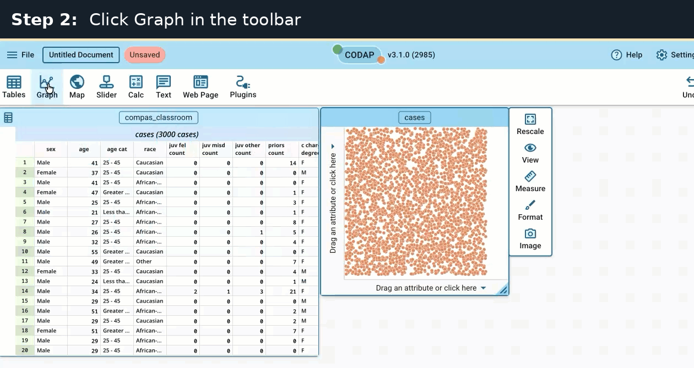
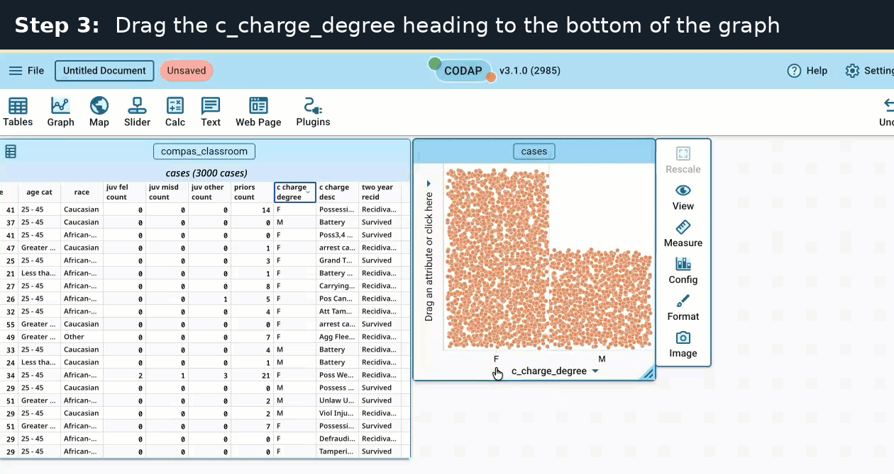
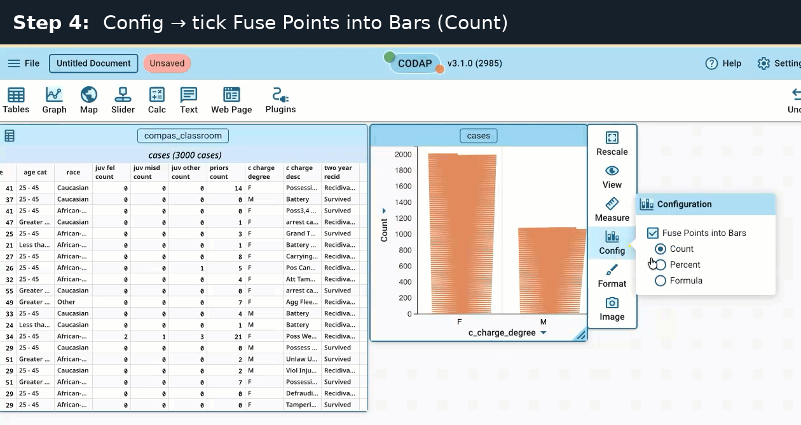
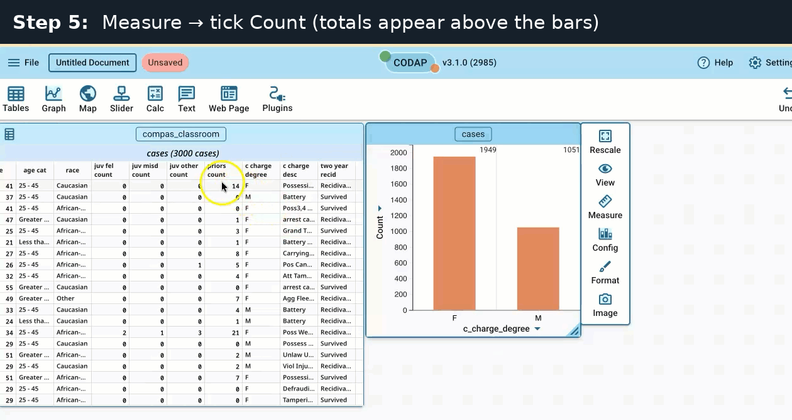
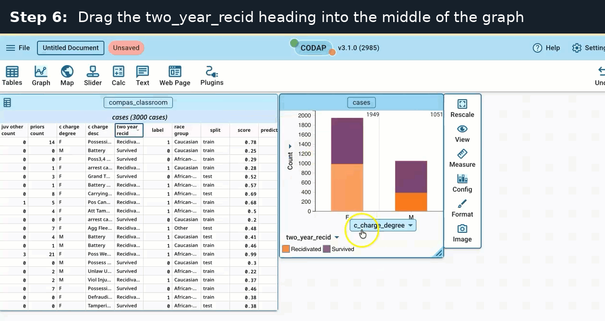
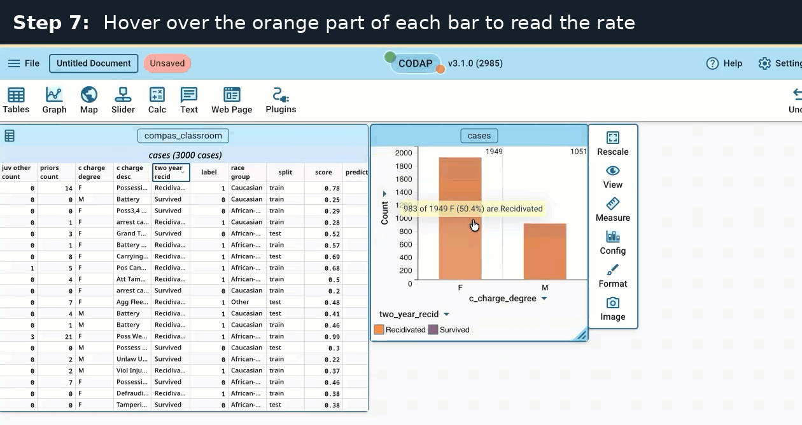

## What you'll do

- Make a bar graph of `c_charge_degree` (F = felony, M = misdemeanor), colored by the outcome.
- Read the **base rate** for each group: the share of the group with label = 1.
- Time: about 5 minutes.

**How to move:** press the right arrow key or the space bar for the next page. Press Esc to see all pages.

::: notes
Everyone does this warm-up on COMPAS, all rows. c_charge_degree is not a protected attribute, so students can learn the tool on numbers they can check.
:::

## Before you start

- Download the warm-up file: [compas_classroom.csv on GitHub](https://github.com/acintron-cc/hon-2501-03/blob/main/datasets/compas_classroom.csv). Click **Download raw file** near the top right.
- Open CODAP in your browser: [https://codap.concord.org](https://codap.concord.org)
- Everyone uses COMPAS for the warm-up, whether you are Partner A (COMPAS) or Partner B (Adult).

::: notes
Partner B students switch to Adult only in Exercise 1. Check that everyone has the file in Downloads before step 1.
:::

## Step 1 of 7: Import the file

Choose **File → Import… → Local File**, then drop `compas_classroom.csv` on the box (or click the box to choose it).

{.r-stretch fig-alt="CODAP's Import Data window with Local File selected and a box labeled 'Drop file here or click here to select a file.'"}

**You should see:** a table named compas_classroom appears on the left.

::: notes
If the file does not show up in the chooser, check the Downloads folder.
:::

## Step 2 of 7: Make a graph

Click **Graph** in the toolbar.

{.r-stretch fig-alt="CODAP with the compas_classroom table on the left and a new, empty graph of dots on the right. The Graph button in the toolbar is highlighted."}

**You should see:** a new graph of dots next to the table.

::: notes
The dots are not arranged yet; that comes in the next step.
:::

## Step 3 of 7: Put c_charge_degree on the bottom

Drag the `c_charge_degree` column heading to the bottom of the graph (“Drag an attribute or click here”).

{.r-stretch fig-alt="The graph now splits the dots into two columns labeled F and M, with c_charge_degree on the horizontal axis."}

**You should see:** the dots split into two columns, F and M.

::: notes
Drag the column heading in the table, not a value in a row.
:::

## Step 4 of 7: Turn dots into bars

Click the graph, open **Config** on the right, and check **Fuse Points into Bars** (Count).

{.r-stretch fig-alt="The Configuration menu beside the graph with 'Fuse Points into Bars' checked and Count selected. The graph shows two bars, F taller than M."}

**You should see:** two bars; the F bar is taller than the M bar.

::: notes
Config is the icon labeled Configuration in the panel to the right of the graph. The graph must be selected first.
:::

## Step 5 of 7: Show the counts

Open **Measure** and check **Count**.

{.r-stretch fig-alt="The Measure menu with Count checked. The numbers 1949 and 1051 appear above the F and M bars."}

**You should see:** 1949 above the F bar and 1051 above the M bar.

::: notes
These are the group sizes (n). Do not check Percent; see the troubleshooting page.
:::

## Step 6 of 7: Color by the outcome

Drag the `two_year_recid` column heading into the **middle** of the graph, not the left edge.

{.r-stretch fig-alt="The bars are now colored: orange for Recidivated at the bottom and purple for Survived on top. A legend under the graph names both colors."}

**You should see:** each bar in two parts: Recidivated at the bottom (orange), Survived on top (purple), with a legend.

::: notes
two_year_recid is the outcome (text) column: the same as label, in words. Dropping it on the left edge stacks the graph into rows instead.
:::

## Step 7 of 7: Read the base rate

Hover over the bottom part of each bar (Recidivated, orange) to read its count and rate.

{.r-stretch fig-alt="A tooltip over the orange part of the F bar reads: 983 of 1949 F (50.4%) are Recidivated."}

**You should see:** F: 983 of 1949 (50.4%); M: 382 of 1051 (36.3%).

::: notes
The tooltip percentage is the base rate: the share of the group with label = 1.
:::

## Check your numbers

| c_charge_degree | People | Recidivated (label = 1) | Base rate |
|---|---|---|---|
| F (felony) | 1,949 | 983 | 0.504 (50.4%) |
| M (misdemeanor) | 1,051 | 382 | 0.363 (36.3%) |

Recidivated means rearrested within two years. Survived means not rearrested.

Compare with your partner: Excel and CODAP should agree exactly.

::: notes
Numbers recomputed from compas_classroom.csv, all 3000 rows.
:::

## If something looks wrong

| What you see | Why | Fix |
|---|---|---|
| The graph stacked into rows instead of coloring | You dropped `two_year_recid` on the left edge | Undo, then drop it in the middle of the graph |
| The legend shows a 0 to 1 color scale | You used `label`, not `two_year_recid` | Drag `two_year_recid` onto the graph instead |
| No totals above the bars | Count is off | Measure → check Count |
| 65% and 35% after checking Percent | That is each bar's share of all people, not the base rate | Uncheck Percent; read the base rate from the hover tooltip |

::: notes
The Percent mistake is the most common one: 65% and 35% are F and M as shares of all 3000 people.
:::

## Next: Exercise 1

Do the same as the warm-up on your own dataset, with your group column instead of `c_charge_degree`:

- **Partner A: COMPAS.** Protected attribute `race_group`. Compare African-American and Caucasian (ignore the Other row).
- **Partner B: Adult.** Protected attribute `sex`. Compare Female and Male. Outcome text column: `class`.

For exact numbers in the table: [CODAP grouping tutorial](codap-grouping.html).

[Optional: watch all the steps in one silent video (about 48 s)](media/codap/CODAP_warmup_steps_labeled.mp4){target="_blank"}. Everything in the video is in the steps above.

::: notes
Only COMPAS and Adult are used in Exercises 1–3.
:::
