## What a notebook is

- A notebook is a web page with **text cells** and **code cells**.
- You will **not** write or change any code. You press a button and read the results.
- Goal: run the class notebook and compare its numbers with your own (Exercise 3).
- Time: about 5 minutes. Have your Exercise 1–3 numbers ready.

**How to move:** right arrow key or space bar. Esc shows all pages.

::: notes
No student has used a notebook before. Stress that nothing they click here can break the class copy.
:::

## Step 1 of 8: Open the class notebook

Open this link: [https://colab.research.google.com/github/acintron-cc/hon-2501-03/blob/main/notebooks/fairness_lesson.ipynb](https://colab.research.google.com/github/acintron-cc/hon-2501-03/blob/main/notebooks/fairness_lesson.ipynb){target="_blank"}

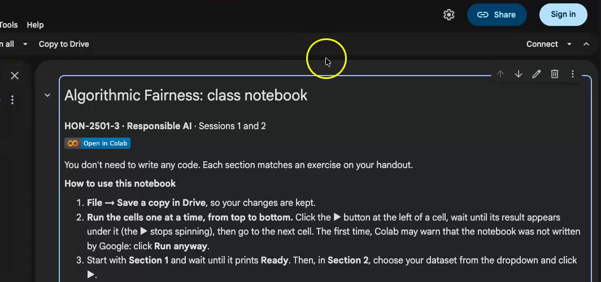{.r-stretch fig-alt="The top of the class notebook in Colab, titled \"Algorithmic Fairness: class notebook\", with the \"How to use this notebook\" list and a blue Sign in button at the top right."}

**You should see:** “Algorithmic Fairness: class notebook” and a **Sign in** button at the top right.

::: notes
The link opens in a new tab, so students can keep these pages open.
:::

## Step 2 of 8: Sign in if asked

Click **Sign in** at the top right and sign in with a Google account. Colab needs one to run code; a personal account works.

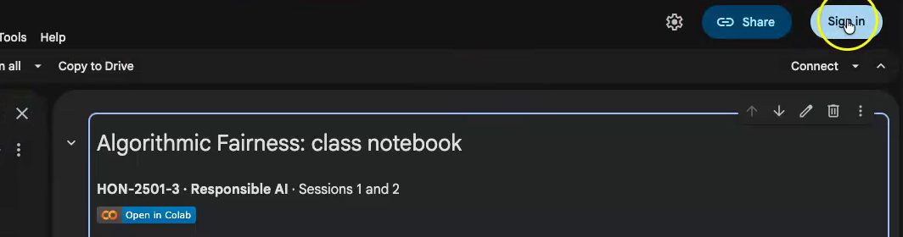{.r-stretch fig-alt="The top right of the notebook page, with the pointer on the blue Sign in button, circled in yellow, next to Share."}

**You should see:** the notebook again, now with your picture at the top right.

::: notes
The sign-in screens are not shown, for privacy. A college account may block Colab; a personal Google account works.
:::

## Step 3 of 8: Save a copy in Drive

Choose **File → Save a copy in Drive**, so your work is kept. Work in the copy from now on.

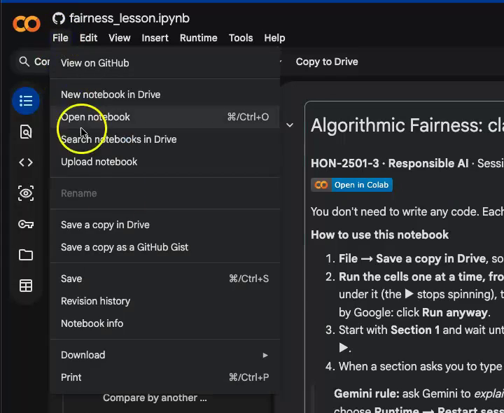{.r-stretch fig-alt="The File menu open on the left, listing New notebook in Drive, Open notebook, Upload notebook, Save a copy in Drive, Save a copy as a GitHub Gist, Save and Download."}

**You should see:** a new tab, “Copy of fairness_lesson.ipynb”.

::: notes
Students close the original tab to avoid working in the wrong one.
:::

## Step 4 of 8: Run cells one at a time

Click the **▶** at the left of a cell. It is finished when the ▶ stops spinning and output appears under it. Only then go to the next cell.

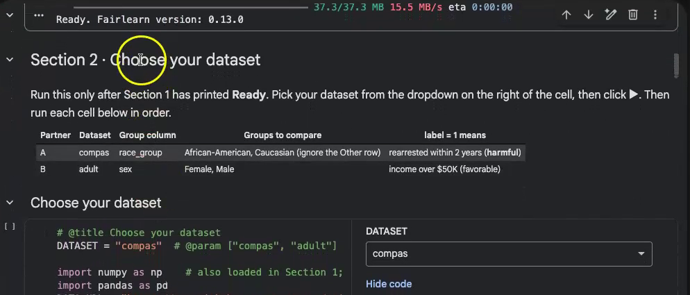{.r-stretch fig-alt="The copied notebook (\"Copy of fairness_lesson.ipynb\") with the line \"Ready. Fairlearn version: 0.13.0\" at the top, followed by the Section 2 heading \"Choose your dataset\" and a table of the two partners' datasets."}

**Do not** use Runtime → Run all: it can time out on the first install.

::: notes
Instructor decision: no Run all. Students have never run code, and Run all can time out on the first install, leaving a confusing state. The still shows a finished cell with its output under it.
:::

## Step 5 of 8: Section 1 · Setup

Click ▶ on “Install and load the tools (just run this)”. Wait 1 to 2 minutes the first time.

{.r-stretch fig-alt="The copied notebook (\"Copy of fairness_lesson.ipynb\") with the line \"Ready. Fairlearn version: 0.13.0\" at the top, followed by the Section 2 heading \"Choose your dataset\" and a table of the two partners' datasets."}

**You should see:** `Ready. Fairlearn version: 0.13.0`

If Colab warns that the notebook was not authored by Google, click **Run anyway**: this appears for any notebook opened from GitHub.

::: notes
The notebook and handout word the warning as "not written by Google"; Colab's own dialog says "authored". The install is sped up in the video.
:::

## Step 6 of 8: Section 2 · Choose your dataset

In the `DATASET` dropdown on the right of the cell, pick `compas` (Partner A) or `adult` (Partner B), then click ▶.

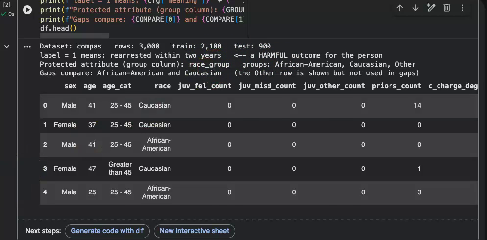{.r-stretch fig-alt="The output of Section 2: \"Dataset: compas rows: 3,000 train: 2,100 test: 900\", the meaning of label 1, the protected attribute race_group, the groups compared, and a table of the first five rows."}

**You should see** (COMPAS): `Dataset: compas   rows: 3,000   train: 2,100   test: 900`. If it says “Note: Section 1 has not run yet…”, go back to step 5.

::: notes
For Adult the line reads rows: 2,000 and test: 600.
:::

## Step 7 of 8: Section 3.1 · Base rates

Click ▶ on “Exercise 1: base rates (all rows)”. Compare with your Exercise 1 numbers.

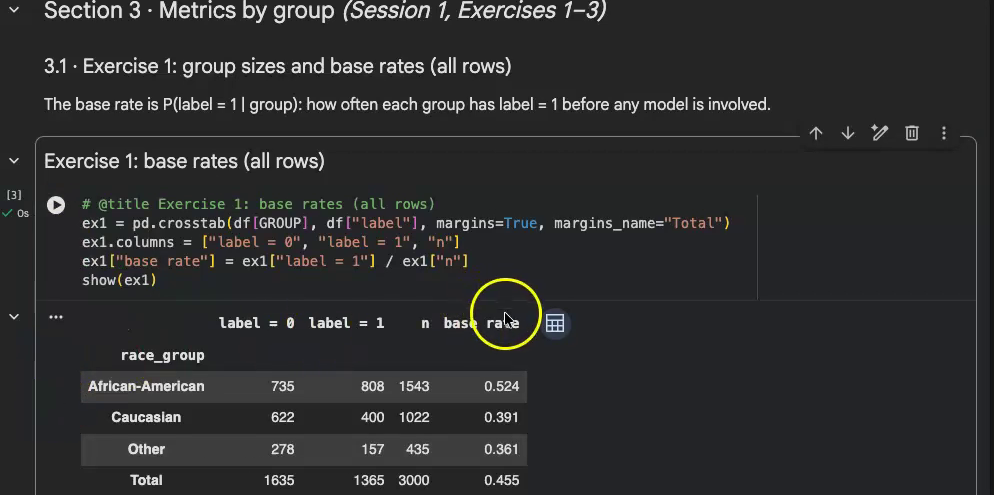{.r-stretch fig-alt="Section 3.1 output, a table by race_group with columns label = 0, label = 1, n and base rate: African-American 735, 808, 1543, 0.524; Caucasian 622, 400, 1022, 0.391; Other 278, 157, 435, 0.361; Total 1635, 1365, 3000, 0.455."}

**You should see** (COMPAS): African-American n 1543, base rate 0.524; Caucasian n 1022, base rate 0.391. Ignore the Other row.

::: notes
Section 3 · Metrics by group has these cells in order: 3.1, 3.2, 3.3 and its chart. Numbers should match students' own to three decimals.
:::

## Step 7 of 8: Section 3.2 · Confusion matrices

Click ▶ on “Exercise 2: confusion matrices (test rows, original model)”. Compare with your Exercise 2 tables.

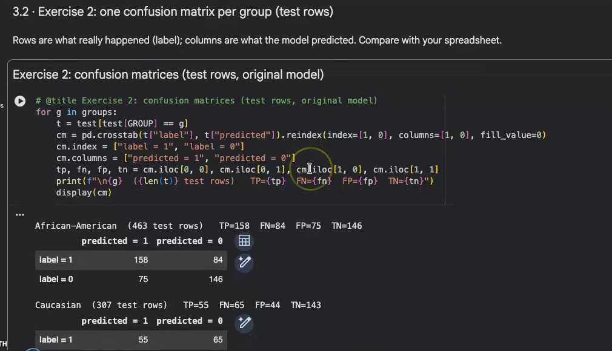{.r-stretch fig-alt="Section 3.2 with the code cell and its output: \"African-American (463 test rows) TP=158 FN=84 FP=75 TN=146\" and a small 2 × 2 table of label by predicted."}

**You should see** (COMPAS): `African-American  (463 test rows)   TP=158  FN=84  FP=75  TN=146`, then the same for Caucasian.

::: notes
Caucasian: 307 test rows, TP=55 FN=65 FP=44 TN=143. The 2 × 2 table has Actual (label) as rows and Predicted as columns.
:::

## Step 7 of 8: Section 3.3 · Rates

Click ▶ on “Exercise 3: MetricFrame”. Compare with your Exercise 3 rates; they should match to three decimals.

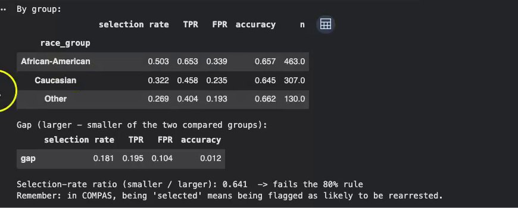{.r-stretch fig-alt="Section 3.3 output: a table of selection rate, TPR, FPR, accuracy and n for African-American, Caucasian and Other, a gap row (0.181, 0.195, 0.104, 0.012), and the line \"Selection-rate ratio (smaller / larger): 0.641 -> fails the 80% rule\"."}

**You should see** (COMPAS): gaps 0.181, 0.195, 0.104, 0.012 and `Selection-rate ratio (smaller / larger): 0.641  -> fails the 80% rule`

::: notes
Gaps are larger minus smaller of the two compared groups: selection rate, TPR, FPR, accuracy.
:::

## Step 7 of 8: Chart: rates by group

Click ▶ on “Chart: rates by group”, the cell after 3.3.

**You should see:** a bar chart of selection rate, TPR, FPR and accuracy, one bar per group. The legend names each group.

Read the bar heights against the numbers in 3.3: the chart shows the same values.

::: notes
The recording does not run this cell, so there is no screenshot.
:::

## Step 8 of 8: Optional · explore further

[If time]{.optional-tag} Nothing to record.

In “3.4 · Optional: a second attribute, or two at once”, choose `COMPARE_BY`, then click ▶:

- “second attribute” (COMPAS: `sex`; Adult: `race`), or
- “both (intersection)”, such as African-American women.

Watch the `n` column: very small groups give noisy numbers.

::: notes
The recording does not run Section 3.4, so there is no screenshot.
:::

## Meet Gemini

Click the **Gemini** button at the bottom center of the page (its tooltip says “Toggle Gemini”). Ask, for example: “Explain what the table in Section 3.1 shows, in plain words.”

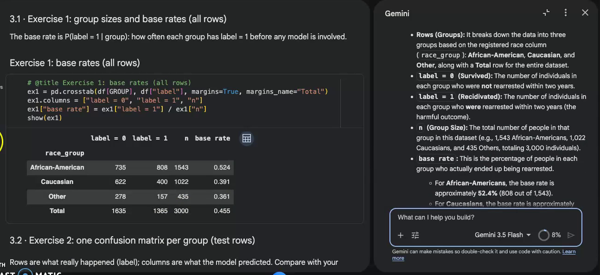{.r-stretch fig-alt="The notebook with the Gemini panel open on the right, showing Gemini's plain-words explanation of the Section 3.1 table and a text box below it."}

Answers vary. Ask Gemini to **explain**; never ask it to rewrite a cell.

::: notes
Instructor-confirmed location of the Gemini button. Gemini's wording differs every time.
:::

## Debugging 1 of 3: A real error

After **Runtime → Restart session**, running only the “Exercise 3: MetricFrame” cell gives an error.

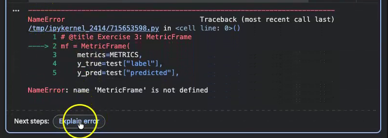{.r-stretch fig-alt="A cell with a red error: a traceback pointing at \"mf = MetricFrame(\" and the message \"NameError: name 'MetricFrame' is not defined\", with an Explain error button under it."}

**You should see:** a red message ending `NameError: name 'MetricFrame' is not defined`. Colab forgot what earlier cells loaded, because they have not run since the restart.

::: notes
This is done on purpose in the recording. Students may meet it for real if Colab disconnects.
:::

## Debugging 2 of 3: Ask Gemini

Click **Explain error** under the red message. Read Gemini's explanation.

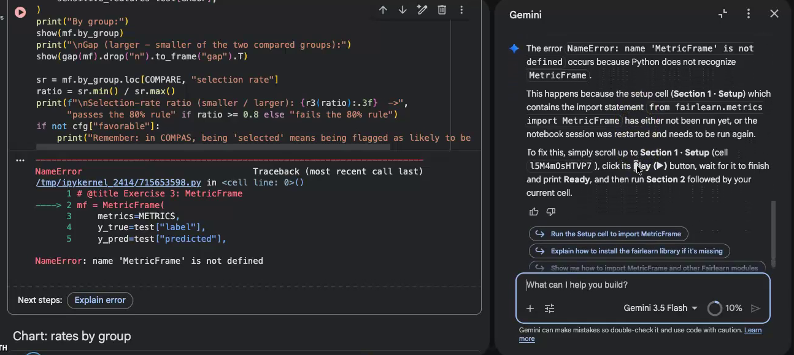{.r-stretch fig-alt="The Gemini panel showing \"Please explain this error: NameError: name 'MetricFrame' is not defined\" and Gemini's explanation, which tells the reader to scroll up to Section 1 - Setup, run it, wait for Ready, then run Section 2 and Section 3. The red error cell is on the left."}

If Gemini offers to change the code, do **not** accept it.

::: notes
Button names may differ slightly in today's Colab; describe them as the recording shows.
:::

## Debugging 3 of 3: The fix

Run the cells again in order, starting at Section 1: Section 1 → wait for Ready → Section 2 → the Section 3 cells.

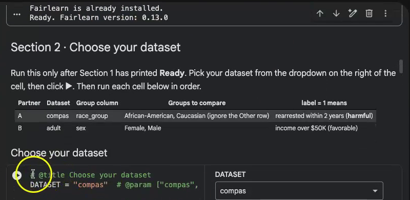{.r-stretch fig-alt="Section 1 and Section 2 rerun in order: the text \"Fairlearn is already installed. Ready. Fairlearn version: 0.13.0\", the Section 2 cell with the DATASET dropdown set to compas."}

**The habit:** read the red error → ask Gemini to explain → run the cells in order from Section 1.

::: notes
Section 1 is quick the second time: it prints "Fairlearn is already installed." then Ready.
:::

## If something looks wrong

| What you see | Fix |
|---|---|
| A red error after a cell | Runtime → Restart session, then run the cells again in order from Section 1 |
| “Note: Section 1 has not run yet” | Run Section 1 and wait for Ready |
| Numbers differ from yours | Check the dropdown shows your dataset, and that your spreadsheet used test rows (`split = "test"`) for Exercises 2–3 |
| “Sign in” keeps appearing | Use a personal Google account |
| The page is slow | Wait for the first cell (it installs Fairlearn) to finish |

::: notes
The most common mismatch: Exercise 2–3 computed on all rows instead of test rows.
:::

## Next: Session 2 preview

[Optional]{.optional-tag} Nothing to do now.

Later you will type weights into the cell **YOUR WEIGHTS HERE** (Section 4) and move two sliders (Section 5).

[Optional: watch all the steps in one silent video (about 5 min)](media/colab/Colab_walkthrough_labeled.mp4){target="_blank"}. Everything in the video is in the steps above.

::: notes
The video is 5 min 13 s; the Google sign-in in it is blurred.
:::
