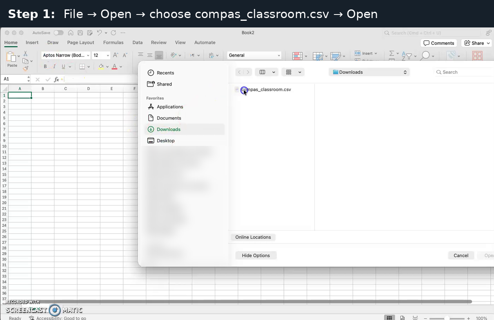
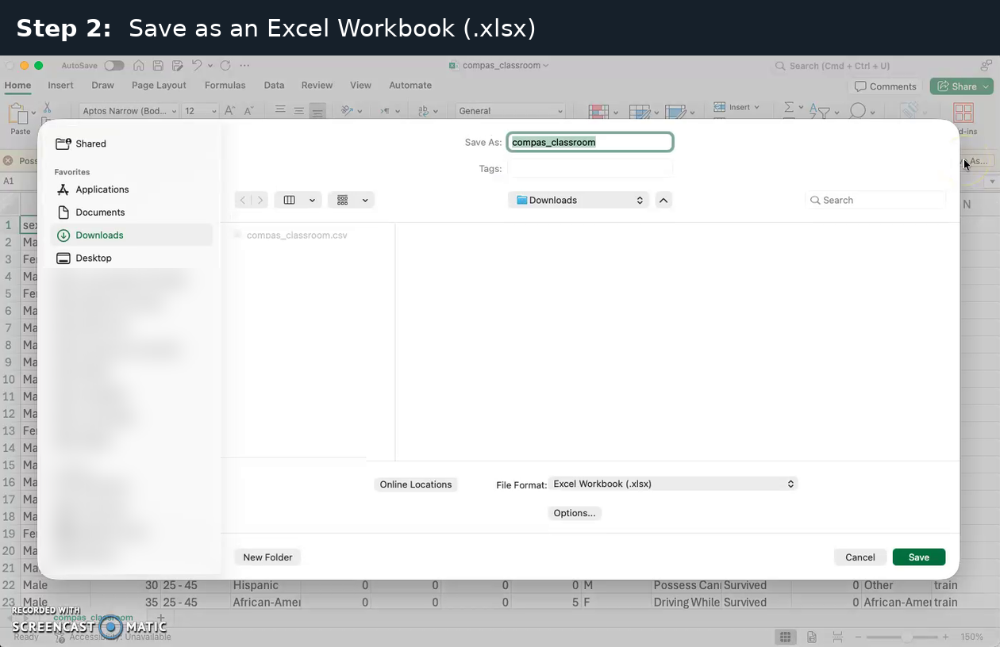
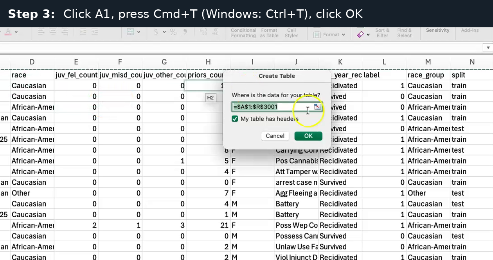
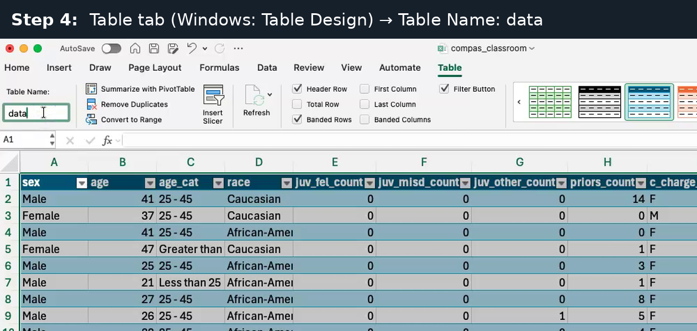
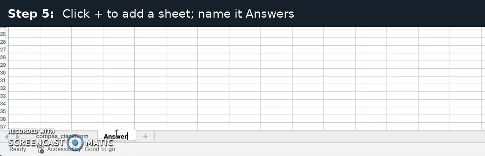
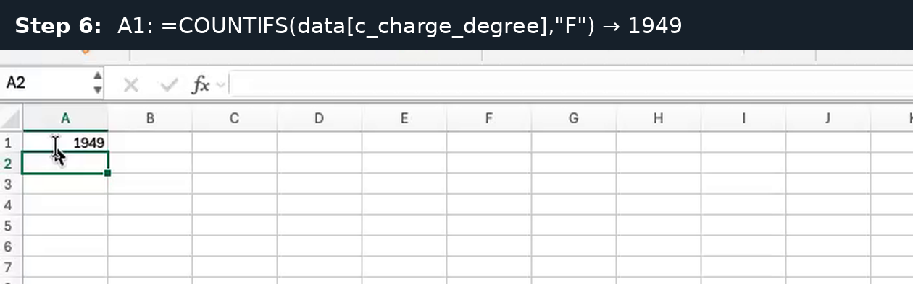
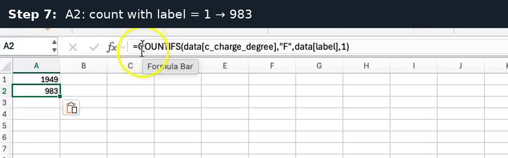
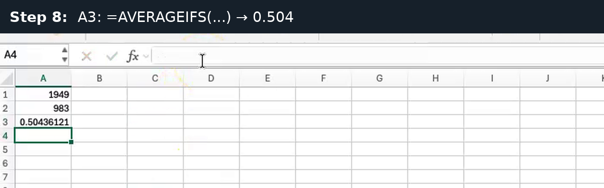
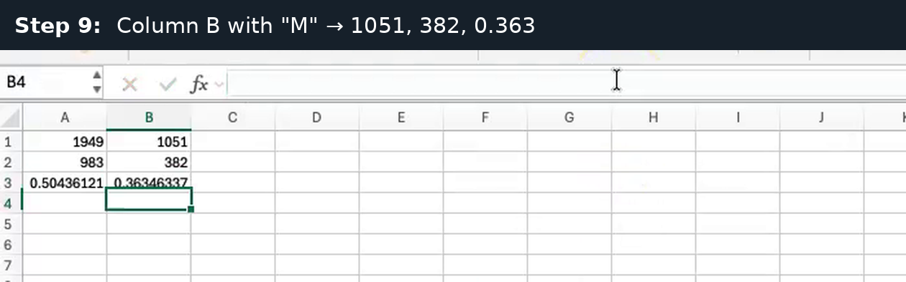

## What you'll do

- Count the people in each `c_charge_degree` group (F = felony, M = misdemeanor) and those with label = 1.
- Compute each group's **base rate**: the share of the group with label = 1.
- Time: about 5 minutes. Recorded in Excel for Mac; Windows differences are in brackets.

**How to move:** press the right arrow key or the space bar for the next slide. Press Esc to see all slides.

::: notes
Everyone does this warm-up on COMPAS, all rows. c_charge_degree is not a protected attribute, so students can learn the tool on numbers they can check.
:::

## Before you start

- Download the warm-up file: [compas_classroom.csv on GitHub](https://github.com/acintron-cc/hon-2501-03/blob/main/datasets/compas_classroom.csv). Click **Download raw file** near the top right.
- Everyone uses COMPAS for the warm-up, whether you are Partner A (COMPAS) or Partner B (Adult).
- Copy formulas; don't retype them. Each formula box has a copy button at its top right.

::: notes
Retyping formulas invites curly quotes and typos; the copy button avoids both.
:::

## Step 1 of 9: Open the file

Choose **File → Open**, select `compas_classroom.csv` in your Downloads folder, and click **Open**.

{.r-stretch fig-alt="Excel's Open window showing the Downloads folder with compas_classroom.csv selected. The personal folders in the sidebar are blurred."}

**You should see:** the data opens, with the column names in row 1 and one person per row.

::: notes
If the whole file lands in column A, see the troubleshooting slide (regional settings use ;).
:::

## Step 2 of 9: Save as an Excel Workbook

Choose **File → Save As**, set File Format to **Excel Workbook (.xlsx)**, and click **Save**.

{.r-stretch fig-alt="Excel's Save As window with the name compas_classroom and File Format set to Excel Workbook (.xlsx). The personal folders in the sidebar are blurred."}

**Why:** a plain .csv file cannot keep the table or the Answers sheet.

::: notes
If students skip this, the table and Answers sheet vanish when they close the file.
:::

## Step 3 of 9: Make it a table

Click cell A1, press **Cmd+T** (Windows: **Ctrl+T**), keep “My table has headers” ticked, and click **OK**.

{.r-stretch fig-alt="The Create Table window over the data, showing the range $A$1:$R$3001 and a ticked box 'My table has headers', with the OK button highlighted."}

**You should see:** the range \$A\$1:\$R\$3001, which is the header row plus 3000 people.

::: notes
A table lets the formulas use column names like data[label] instead of cell ranges.
:::

## Step 4 of 9: Name the table data

On the **Table** tab (Windows: **Table Design** tab), change Table Name from Table1 to `data` and press Enter.

{.r-stretch fig-alt="The Table tab in Excel's ribbon with the Table Name box changed to 'data'; the data below now has coloured table rows and filter arrows in the header row."}

**You should see:** coloured table rows and filter arrows in the header row.

::: notes
The name must be exactly data (lower case) or the formulas give #NAME?.
:::

## Step 5 of 9: Add an Answers sheet

Click **+** at the bottom to add a sheet, then double-click its tab and name it `Answers`.

{.r-stretch fig-alt="The sheet tabs at the bottom of Excel, with a new tab being named Answers next to the compas_classroom tab."}

**You should see:** a tab named Answers next to the compas_classroom tab.

::: notes
Students record all their numbers for Exercises 1–3 on this sheet.
:::

## Step 6 of 9: Count the F group

In cell A1 of Answers, paste this formula and press Enter:

```
=COUNTIFS(data[c_charge_degree],"F")
```

{.r-stretch fig-alt="The Answers sheet with 1949 in cell A1."}

**You should see:** 1949, the number of people charged with a felony (F).

::: notes
COUNTIFS counts the rows that meet every condition listed.
:::

## Step 7 of 9: Count label = 1 in F

In A2, paste this formula and press Enter:

```
=COUNTIFS(data[c_charge_degree],"F",data[label],1)
```

{.r-stretch fig-alt="Cell A2 shows 983; the formula bar shows =COUNTIFS(data[c_charge_degree],\"F\",data[label],1)."}

**You should see:** 983, the people in F who were rearrested (label = 1).

::: notes
Same formula with a second condition added: label equals 1.
:::

## Step 8 of 9: The base rate for F

In A3, paste this formula and press Enter:

```
=AVERAGEIFS(data[label],data[c_charge_degree],"F")
```

{.r-stretch fig-alt="Cells A1 to A3 show 1949, 983 and 0.50436121."}

**You should see:** 0.50436121, about 0.504. (Home → Decrease Decimal, or format as a percentage, to show fewer digits.)

::: notes
The average of a 0/1 column is the share of 1s, so it is the base rate: 983 / 1949.
:::

## Step 9 of 9: Repeat for M

Paste the three formulas in column B (B1, B2, B3), with "M" instead of "F":

```
=COUNTIFS(data[c_charge_degree],"M")
=COUNTIFS(data[c_charge_degree],"M",data[label],1)
=AVERAGEIFS(data[label],data[c_charge_degree],"M")
```

{.r-stretch fig-alt="Column A shows 1949, 983 and 0.50436121 (F); column B shows 1051, 382 and 0.36346337 (M)."}

**You should see:** 1051, 382 and 0.36346337 (about 0.363).

::: notes
The copy button copies all three lines; students paste one line per cell.
:::

## Check your numbers

| c_charge_degree | People | Recidivated (label = 1) | Base rate |
|---|---|---|---|
| F (felony) | 1,949 | 983 | 0.504 (50.4%) |
| M (misdemeanor) | 1,051 | 382 | 0.363 (36.3%) |

Recidivated means rearrested within two years. Survived means not rearrested.

Compare with your partner: Excel and CODAP should agree exactly.

::: notes
Numbers recomputed from compas_classroom.csv, all 3000 rows.
:::

## If something looks wrong

| What you see | Why | Fix |
|---|---|---|
| `#NAME?` | Table not named `data`, or curly quotes pasted from Word | Rename the table; retype the quotes |
| `0` | Group name spelled differently, e.g. "f" vs "F" | Match the spelling exactly |
| The CSV opens as one column | Regional settings use `;` | Data → From Text/CSV → Comma |
| Answers sheet or table gone after closing | The file was saved as .csv | Save As → Excel Workbook |
| A long decimal like 0.50436121 | That's fine | It rounds to 0.504 |

::: notes
The #NAME? case is the most common. Curly quotes come from copying out of Word; the copy button on these slides gives straight quotes.
:::

## Next: Exercise 1

Use the same three formulas with your protected attribute instead of `c_charge_degree`, and your two groups instead of "F" and "M":

- **Partner A (COMPAS):** `race_group`, with "African-American" and "Caucasian".
- **Partner B (Adult):** `sex`, with "Female" and "Male".

Remember to save your own file as .xlsx and make it a table named `data` too.

[Optional: watch all the steps in one silent video (about 100 s)](media/excel/Excel_warmup_steps_labeled.mp4){target="_blank"}. Everything in the video is in the steps above.

::: notes
The handout lists the exact formulas for each group in its Exercise 1 table.
:::
